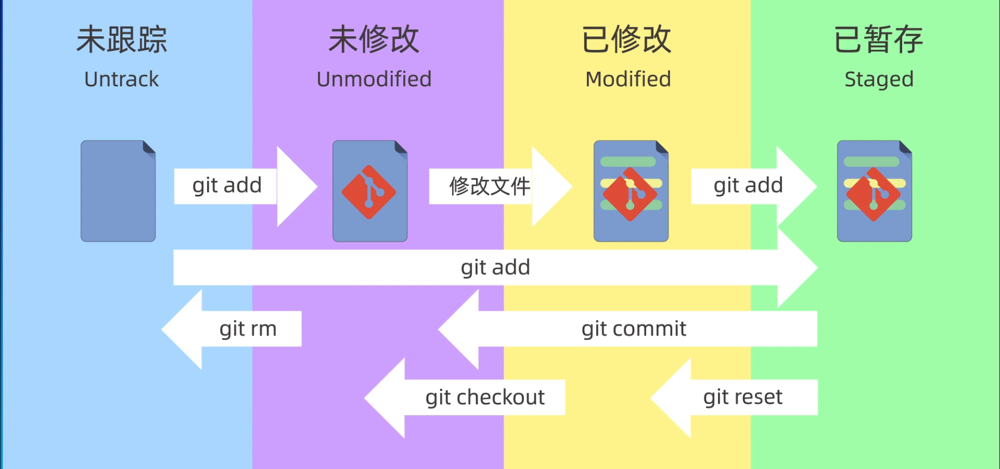

# Git 基本使用

## 初始配置
*  `git config --global <key> <value>` 配置全局参数. 不添加 `--global` 仅对当前仓库有效, `--system` 对所有用户有效, 下同
    * `git config --global user.name <username>` 配置用户名
    * `git config --global user.email <email>` 配置邮箱
    * `git config --global credential.helper store` 启用保存用户名和密码, 使得无需每次输入
* `git config --global --list` 查看指定区域的配置信息, 按 `q` 退出查看

## 新建仓库
* `git init` 在本地目录创建仓库
* `git init <name>` 在当前工作目录的 `<name>/` 目录下创建仓库
* `git clone <url>` 拉取远端仓库至本地
* `.git` 目录是隐藏目录, 需要 `ls -a` (Linux) 或 `ls -Force` (Powershell) 显示

## 基本概念
### 区域
| 名称 | 介绍 | 备注 |
| :-: | :- | :- |
| 工作区 | Working Directory 本地工作目录 | `.git` 所在目录 |
| 暂存区 | Staging Area/Index 临时存储区域 | `.git/index` |
| 本地仓库 | Local Repository Git 存储代码和版本信息的主要位置 | `.git/objects` |

### 文件状态
| 名称 | 介绍 |
| :-: | :- |
| 未追踪 | Untrack / 新创建未被 Git 管理的文件 |
| 未修改 | Unmodified / 已被 Git 管理但内容未发生变化的文件 |
| 已修改 | Modified / 已被 Git 管理且内容已发生变化且未添加至暂存区的文件 |
| 已暂存 | Staged / 已被 Git 管理且内容已发生变化且已添加至暂存区的文件 |

<!-- ↓ 直接把图片当作链接的 content ↓ -->
> 来着 [【GeekHour】一小时Git教程@BiliBili p04-03:30
> 
> ](https://www.bilibili.com/video/BV1HM411377j?p=4&t=3m30s)

### 分支
| 名称 | 介绍 | 备注 |
| :-: | :- | :- |
| 公有分支 | 有 >= 2 个用户使用的分支 | 不能使用非 `git revert` 恢复修改, 否则会造成 `commit` 缺失无法同步 |
| 个人分支 | 仅有 1 个用户使用的分支 |  |
| `HEAD` | 默认指向分支的最新提交节点 | `HEAD^` 或 `HEAD~` 表示 `HEAD` 前第 1 个提交, `HEAD~<n>` 表示 `HEAD` 前第 `n` 个提交 |

## 添加与提交文件
* `git status` 查看仓库当前状态
* `git status -s` 查看仓库当前状态, 以精简内容显示
* `git add <file>` 将 (未追踪的) 文件添加至暂存区. 并且, 该命令支持使用通配符 (包含但不限于 `*`) 添加 (多个) 文件; 同时, 也可以直接添加文件夹, 会直接将整个文件夹包括其所有层级子目录内的文件全部添加至暂存区
* `git rm --cached <file>` 将 (已暂存的) 文件移除暂存区
* `git commit -m <message>` 提交修改 (仅提交暂存区的文件). 若不指定 `-m` 参数, 则会进入一个交互式页面, 默认使用 `vim` 编辑提交信息
* `git log` 查看提交记录. 使用 `--oneline` 参数查看简洁的提交记录, 仅显示提交的 HASH 和提交信息
* `git commit -a` 提交时添加所有文件 (类似于 `git add .`)
> Git 默认不会添加空文件夹至仓库, 包括空文件夹内仅含空文件夹

## 回退版本与恢复文件
### `git reset` 回退版本
* `git ls-files` 查看暂存区内容
* `git reflog` 查看操作的历史记录

在如下命令后加 `commit` 即可回退至指定提交

| 命令 | 保留工作区 | 保留暂存区 | 是默认值 | 行为备注 |
| :-: | :-: | :-: | :-: | :- |
| `git reset --soft` | √ | √ | | 类似于 "失忆" |
| `git reset --hard` | × | × | | 直接强制同步为指定 `commit` 的记录 (**慎用**) |
| `git reset --mixed` | √ | × | √ | 相比 `--soft`, 此模式需要重新 `git add` 添加至暂存区 |
> 若发生 `git reset --hard` 误操作, 可使用 `git reflog` 找到误操作前的 `commit` 并 `git reset --hard <commit>` 回退即可

### 各方法恢复文件
> 感谢 [十分钟学会常用git撤销操作，全面掌握git的时光机@BiliBili](https://www.bilibili.com/video/BV1ne4y1S7S9)

| 区域 | 介绍 | 如何恢复至之前的状态 | 恢复注解 |
| :-: | :- | :- | :- |
| Disk | 本地磁盘, 直接由编辑器修改 | 使用 `git checkout <file>` 或 `git restore <file>` | 后者仅支持较新版本, 在如上所述情况下两者等价 |
| Staging | Changes to be committed / 暂存区 (`add` 或更改但未 `commit` 的文件所在) | 使用 `git reset <file>` 或 `git restore --staged <file>` | 从暂存区移除, 不改变硬盘文件更改. 后者仅支持较新版本, 在如上所述情况下两者等价 |
| | | 使用 `git checkout HEAD <file>` | 同时重置硬盘更改和暂存区更改 (`HEAD` 代表上一次的 `commit`) |
| Local | 本地 Git 仓库 | 使用 `git reset --soft HEAD~1` | 把本地 Git 仓库状态修改为上上次 `commit` 的状态, 不改变硬盘文件, 并将硬盘变换添加至暂存区 (`HEAD~1` 表示上一次 `commit` 前 `1` 次的 `commit`) |
| | | 使用 `git reset HEAD~1` 或 `git reset --mixed HEAD~1` | 重置 `commit` 并将文件移出暂存区, 仅保留硬盘修改 |
| | | 使用 `git reset --hard HEAD~1` | 完整重置状态, 覆盖本地磁盘和暂存区修改 |
| | | 使用 `git revert HEAD` | 使用 Git 生成一个 `commit`, 使得其作用效果与 `HEAD` 相反 (`-commit`). 其参数为一个或多个 `commit`, 并且可以撤销先前任意一个或多个 `commit`, 这与上述方法不同 |
| Remote | 远端仓库 | 使用 `git revert HEAD` 后 `git push` | 远端分支是一个公有分支 |
| | | 使用 `git reset --hard HEAD~1` 后 `git push -f` |  远端分支是一个个人分支 (`-f` 表示 `force`) |

## 差异查看
| 命令 | 行为 |
| :-: | :- |
| `git diff` | 比较工作区与暂存区的差异 |
| `git diff <commit>` | 比较指定版本 (与当前工作区与暂存区) 的差异 |
| `git diff --cached` 或 `git diff --staged` | 比较暂存区和版本的差异 |
| `git diff <commit_a> <commit_b>` | 比较两个版本间的差异 |
| `git diff <branch_a> <branch_b>` | 比较两个分支间的差异 (详见分支笔记) |
| `git diff <file>` | 比较指定文件的差异 |
> 某些命令可以组合使用, 例如可以使用 `git diff <commit_a> <commit_b> <file>` 查看指定文件的指定版本间的差异

差异输出示例:  (`#` 后为注解内容)
```diff
diff --git a/test.file b/test.file  # 发生变更的文件
index 3c0eb7a..cf294a0 100644  # `index` 文件哈希 权限
--- a/test.file
+++ b/test.file
@@ -1 +1,2 @@
 test_file
+this is something new  # 修改的内容
```

## 删除文件
| 命令 | 行为 |
| :-: | :- |
| `rm` (Linux), `del` (CMD) 或 `rm` Powershell, 后使用 `git add <file>` | 删除工作区和暂存区指定文件. `git add <file>` 同步暂存区与工作区状态, 使得文件在暂存区也被删除 |
| `git rm` | 同时删除暂存区和工作区文件 |
| `git rm --cached` | 仅删除暂存区文件, 保留工作区文件 |
> 使用 `-r` 递归删除指定文件夹
