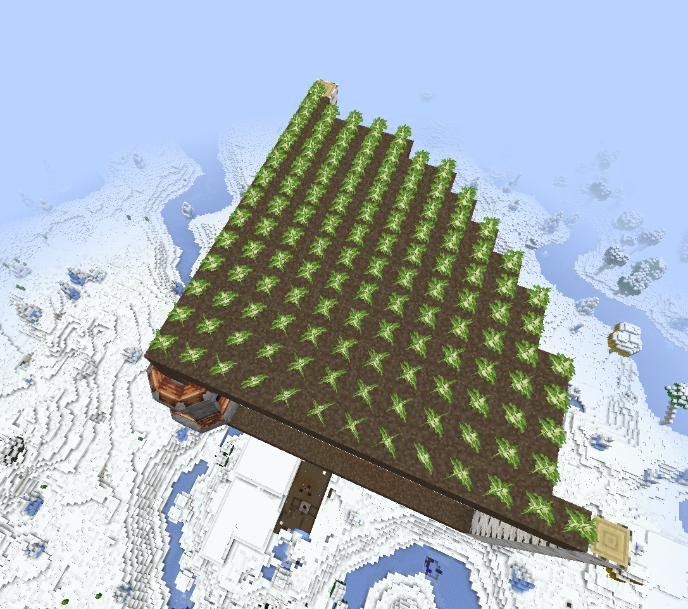
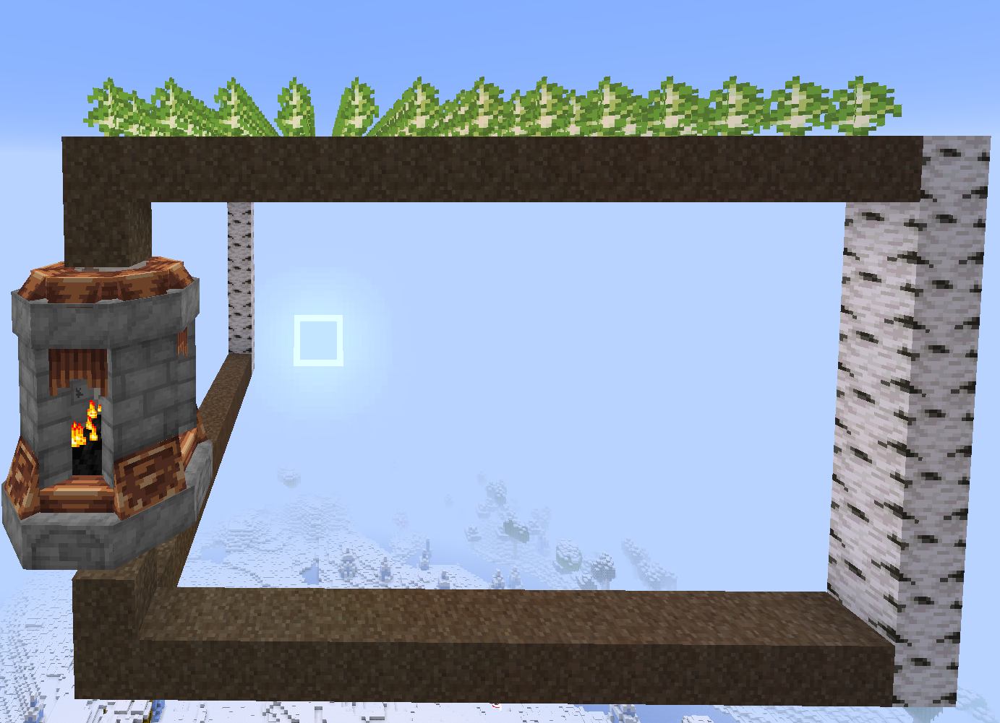

# 关于能量塔

## T1 (一级能量塔)
### 作用范围 (版本: ^0.5)
在 官方 Wiki 的教程中, 可能因为版本过时, 或其他原因造成能量塔范围出现问题

> "一级能量塔，没有什么附属，目前只能增温20°与以17\*17范围的增温[^wiki01]"

> "一级能量塔能提供以第二层中间为中心的17\*17\*17的温场，过载不会影响温场范围[^wiki02]"

但经实际测试, 在我使用的整合包版本下 (版本见整合包内容主页), 其水平作用范围仅有以能量塔核心为中心的各水平方向的GUI显示的"增温范围"距离, 垂直作用范围则为以能量塔核心为中心的各垂直方向 4 格, 并成圆柱形(最小单位为一方块)分布  

>   
> 如图, 已种植树苗的泥土即为其水平作用范围的 1/4  
> 将该作用范围以能量塔核心为中心复制三份, 每份旋转 90度 即为其完整的水平作用范围

>   
> 如图, 白桦原木所表示的范围即为其垂直作用范围  
> 若将上方泥土再向上移动一格则树苗无法生长

其实官方在更新日志里有提到范围修改
> 来自 0.5.6 官方更新日志
```plain
[修改]
能量塔的设置可以继承到新的能量塔上了。
现在能量塔加热过程改为缓慢上升。(cr. ceary)
减少了地表植被生成。
减少了部分群系。
能量塔范围修改：
范围1级向上5格，向下3格，半径12的圆柱体。
范围2级向上9格，向下5格，半径16的圆柱体。
加热器改为向上4格，向下1格，半径7的圆柱体。
温度球改为显示体感温度。
动植物需要的温度等级下降。
土壤温度改为土壤解冻程度。
死亡改为只消耗一半精力值
```

### 作用范围 (版本: ^0.6.0-rc7)
自 0.6.0-rc7 起, T1 能量塔的作用范围是以能量塔核心为中心, UI 内显示的 "增温范围" 距离的球体  

在 0.6.0-rc7 中, T1 能量塔不开启超频, "增温范围" 为 `16`, 能量塔核心 (不含核心) 上方第 15 格是能量塔的最大作用范围, 而第 15 格旁边 4 格均不能被加热 (默认加热到 10 ℃)  
而上方第 14 格水平四个方向 (不含本格) 延伸各 5 格是能量塔的最大作用范围

[^wiki01]: [最后的工程师手册 - TeamMoeg官方WIKI](https://wiki.teammoeg.com/index.php?title=%E5%85%B3%E4%BA%8E%E8%83%BD%E9%87%8F%E5%A1%94%E7%9A%84%E4%BA%8C%E4%B8%89%E4%BA%8B#.E4.B8.80.E7.BA.A7.E8.83.BD.E9.87.8F.E5.A1.94.E7.9A.84.E9.A3.9F.E7.94.A8)

[^wiki02]: [关于能量塔的二三事 - TeamMoeg官方WIKI](https://wiki.teammoeg.com/index.php?title=%E6%9C%80%E5%90%8E%E7%9A%84%E5%B7%A5%E7%A8%8B%E5%B8%88%E6%89%8B%E5%86%8C#2.2_.E4.B8.80.E7.BA.A7.E8.83.BD.E9.87.8F.E5.A1.94)
