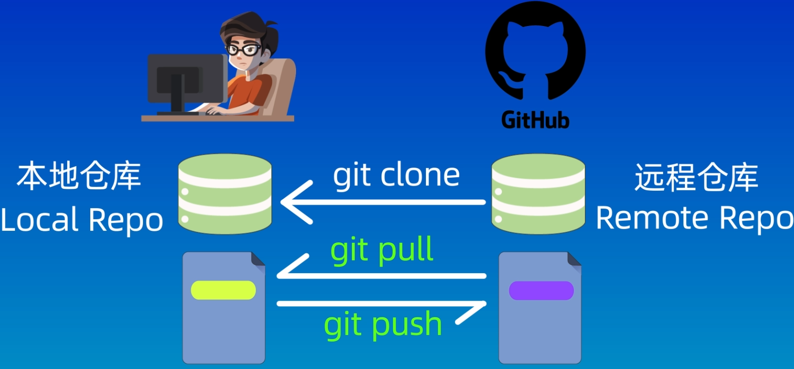

## SSH 配置
* `ssh-keygen -t rsa -b 4096` 在 `~/.ssh` 下生成基于 RSA 4096 位 的 SSH 公私钥  
无扩展名的文件即为私钥, 切勿泄露该文件. 以 `.pub` 结尾的文件为公钥, 需要复制其内容并添加至您的远程 Git 服务提供商 (包括但不限于 GitHub) 的 SSH Keys (或类似选项)

## 远程与本地
* `git pull` 用于将远程仓库的修改应用至本地仓库
* `git push` 用于将本地仓库的修改应用至远程仓库
* `git clone <url>` 将远程仓库 `clone` 至本地

> 本地仓库与远程仓库是两个独立的 Git Repo, 两者不会互相影响  
> 来自 [【GeekHour】一小时Git教程@BiliBili p11 08:50
> 
> ](https://www.bilibili.com/video/BV1HM411377j?p=11&t=8m50s)

## 关联仓库
* `git remote add <shortname> <url>` 添加远程仓库 (对于只有一个远程仓库的仓库, `shortname` 一般习惯为 `origin`)
* `git remote -v` 查看当前仓库的所有远程仓库别名 (`shortname`) 和 URL
* `git branch -M <branch>` 指定主分支为 `branch`
* `git push -u <shortname> <local_branch>[:<remote_branch>]` 将本地的 `local_branch` 分支与远程 `shortname` 的 `remote_branch` 分支关联, 并推送更改  
当本地分支与远程分支相同时, 可以省略 `remote_branch` 写做 `git push -u <shortname> <branch>`  
`-u` 代表 upstream  
在一般情况下, 在关联分支后, 可以直接使用 `git push` 推送修改
* `git pull <shortname> <remote_branch>[:<local_branch>]` 将远程 `shortname` 的 `remote_branch` 分支修改拉取至本地的 `local_branch` 分支  
同理, 当本地分支与远程分支相同时, 可以省略  `git pull <shortname> <branch>`  
在一般情况下, 在关联分支后, 可以直接使用 `git pull` 拉取修改
* `git fetch` 仅获取远程仓库内容, 不自动合并至本地仓库 (关于如何手动合并分支, 解决分支冲突, 详见分支笔记)
