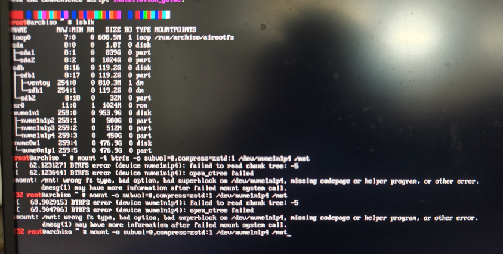
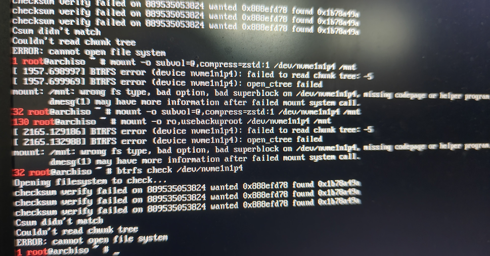
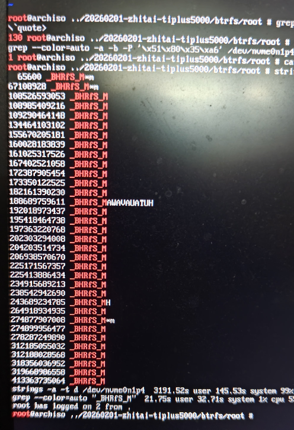

(未经特殊说明, 使用公元纪年法 和 UTC+8 时间)  
时间 2026 年 01 月 31 日下午 16 时许, 本人在尝试开启计算机时出现无法进入 Archlinux 系统问题

## 背景

本人日常使用安装有 linux-zen 内核的 Archlinux, 搭配 KDE 桌面环境  
根目录与 home 目录使用常见 Archlinux Btrfs subvolume (子卷) 安装方式: 将 子卷 `@` 作为 `/`, 子卷 `@home` 作为 `/home`, 作为操作系统安装位置, 分区大小 450 GiB  
并开启了 `zstd:1` 透明压缩  
系统硬盘使用 致态 TiPlus5000[^ssdinfo], 于 2023 年 01 月购入, 硬盘容量 1 TB

## 过程

### 2026 年 01 月 30 日 22 时至 24 时

本人对系统进行了更新, 运行了如下命令

```sh
sudo pacman -Syu --noconfirm
```

由于 2026-01-30 (UTC), linux 以及 linux-zen 发布了 `6.18.8` 稳定版本, 导致了该系统更新更新了 kernel (内核)

但是, 在初次更新内核时, 出现了 DKMS (内核模块) 安装失败的问题, 我尝试了

```sh
sudo pacman -S linux-zen
```

成功后便认为更新成功, 随即关闭了计算机

### 2026 年 01 月 31 日 16 时至 17 时
本人如往常般打开计算机, 但发现 Grub 引导美化主题背景图丢失, 以为可能是更新导致 Grub 配置失效, 重新安装主题即可, 便忽略了该问题随机进入系统引导

后, 发现系统启动失败, 在系统启动失败的 fallback 的 Shell 中, 发现任何命令无法运行, 根目录无法挂载

本人联想到先前 Btrfs 出现物理可用区域满 (数据在物理磁盘的末尾导致没有空余), 可能是该原因导致类似问题, 便想着进入 ISO 镜像环境使用 `btrfs balance` 或许可以恢复

后进入 ISO 安装镜像, 开始修复系统

### 2026 年 01 月 31 日 17 时及后
本人尝试修复 Btrfs 文件系统, 通过查阅 [Archwiki](https://wiki.archlinux.org/title/Btrfs), 进行状态检查后, 发现 super chunk (超级块) 的地址指向了 800+ GiB 的位置, **包括用于备份的另一个 super chunk**, 远超分区实际大小的地址上限, 无论是 `btrfs check` 还是 `btrfs rescue` 均报错

挂载报错
```log
[xxx] BTRFS error (device nvme1n1p4): failed to read chunk tree: -5
[xxx] BTRFS error (device nvme1n1p4): open_ctree failed
```
[^why-device-changed]


> 上图是进入 ISO 镜像环境的 Archlinux 进行挂载的画面

`btrfs check` 报错, 显示存在 checksum failed 的块
```log
Opening filesystem to check...
checksum verify failed on xxx wanted 0xxxx found 0xxxx
...
```

> 其中, 这几个报错的地址都是 800+ GiB 的不存在地址, 必定会导致 checksum failed

通过和 Archlinux-CN Telegram 群的群友们交流, 得知由于两个 super chunk 均已损坏, 无法修复文件系统, 群友说似乎 super chunk 的内容已经不在硬盘上存在了

### 2026 年 02 月 01 日
我怀揣着不甘, 在 Gemini 的帮助下, 尝试通过全盘扫描 `_BTRFS_M` 魔法头, 找到 chunk tree 实际位置

通过 smartctl 和 nvme 工具的信息, 硬盘健康度貌似没有问题. 有群友认为, 可能是早期 致态 固件存在问题, 导致部分写入会存在 bug, 从而丢失数据

不过经历无数次的尝试, 最终还是未能恢复数据


> 扫描到的魔法头地址, 但是没一个可以用的

## 结果
最终, 似乎还是未能恢复数据, 好在我的项目基本上是由备份的, 可惜我的 Minecraft 存档和 JetBrains 全家桶 的配置就永不得见日了

目前来说, 我还未擦除硬盘该分区的数据, 如果有能力者可以尝试在 [Github Discussions](https://aka.lovemilk.top/github/notes/discussions) 发出你的解决方法, 至少可以给我一线生机吧...

## 最终结果 / After Story
**2026 年 02 月 07 日上午 8 时 30 分许**, 本人决定擦除硬盘数据并售后, 更换新的硬盘

为我的没有备份的数据默哀 3 秒钟...
> ~~话说应该是默哀 3 ns 才对, at least for the CPU~~

本人已经在学习如何使用 Kopia[^kopia] 对文件进行快照记录以免被意外覆盖, 并加大 Syncthing[^syncthing] 备份范围与力度, 减少不必要的数据损失

[^ssdinfo]: 长江存储官网: https://www.ymtc.com / 致态 TiPlus5000: https://baike.baidu.com/item/致态TiPlus5000/61815836

[^why-device-changed]: 在下文中, 设备可能变为了 `nvme0n1p4`, 这是重新拆装硬盘并启动到 ISO 镜像环境导致的, 实际上指同一块分区. 并且有且仅有该硬盘的分区达到了 `p4`, 其余至多 `2`, 这也作证了为同一块物理磁盘

[^kopia]: https://kopia.io/ Fast and Secure Open-Source Backup Software

[^syncthing]: https://syncthing.net/ Syncthing is a continuous file synchronization program
