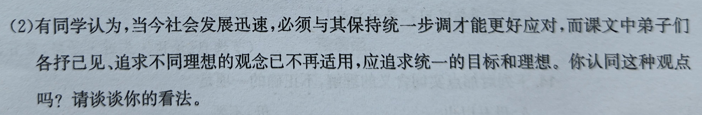

import ChinesePassageComment from "@/components/misc/custom/ChinesePassageComment.vue";

> 字数要求 200 字左右

# 目标统一性与一致性相呼应
> —— 论个人目标与集体目标的相互作用

统一的目标不具有泛适用性. 世界上不存在两片一样的叶子. 由于生物存在基因突变的根本属性, 每个各个均必然存在个体差异, 对于人类, 就会形成不同性格与思维方式. 统一的目标难以说服不同个体, 从而导致达成目标的动力缺失和/或效果不佳.

同时, 统一的目标难以体现部分群体在对应领域的强项. 若有人在某一特定领域能力很强, 而目标又是笼统的全面发展, 可能导致难以将个人优势发挥, 从而影响社会进步速度. 其次, 对于大众群体, 本身个性可能不显著, 若是使用统一的目标, 难以进行差异化竞争, 导致就业压力增加, 减少社会活力.

最后, 思考问题不仅要思考问题的答案, 更要质疑问题本身. 我认为, 我们可以在适当时候追求统一的目标, 反之追寻自己的目标. 目标与社会身份和场景变化相适应, 长期目标在必要时设立为社会目标, 短期目标设立为个人目标, 才能在不断变化和进步的世界中长久适应与生存.

{/* <ChinesePassageComment source="教师" score={null}>
</ChinesePassageComment> */}
